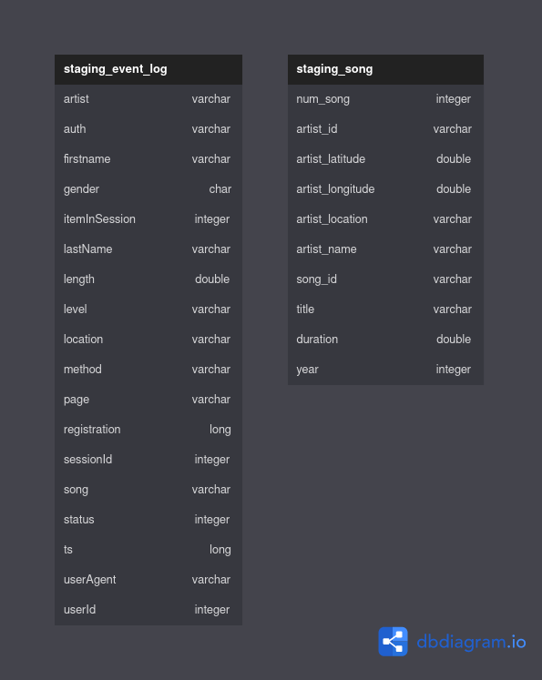
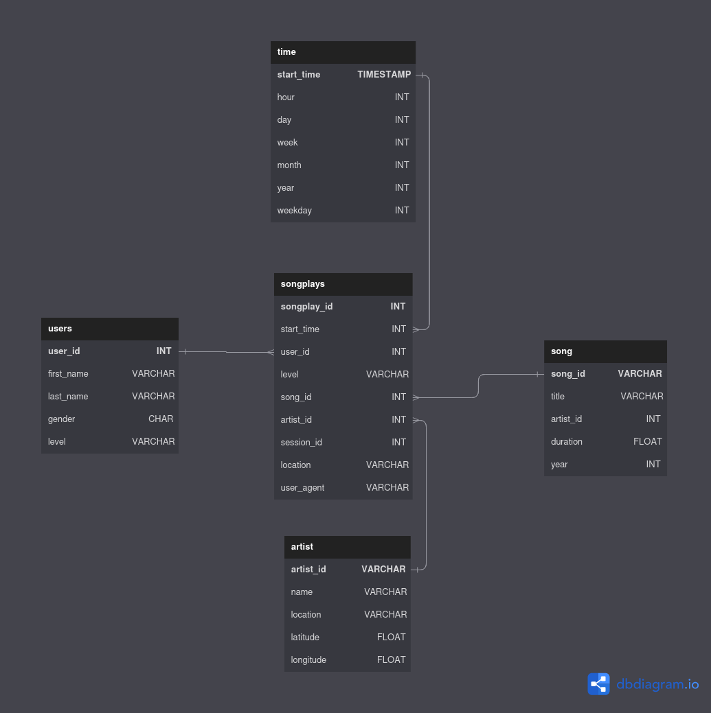

# Sparkify Data Lake


## Table of Contents

1. [Sparkify Data Lake](#sparkify-data-lake)
2. [Requirements](#requirements)
3. [Project Structure](#project-structure)
4. [Installation and Configuration](#installation-and-configuration)
5. [Execution](#execution)
6. [Results](#results)
7. [Additional Data Processing Steps](#additional-data-processing-steps)

In this project, we will implement a Data Lake for the fictional company
Sparkify. The company is a music streaming platform and is interested in
analyzing the data generated by its users to better understand their behavior
and preferences.

The Data Lake implementation consists of processing and storing raw data in a
centralized and easily accessible repository for future analysis and processing.

## Requirements
 * Python 3.8+
 * Apache Spark
 * Hadoop (HDFS)
 * AWS S3
 * Configure AWS access keys in the `dl.cfg`

## Project Structure

* `dl.cfg`: Configuration file with AWS access keys
* `etl.py`: Python script responsible for extracting, transforming, and loading
 (ETL) data into the data lake

* `README.md`: Markdown file with information about the project

## Installation and Configuration

1. Install Python 3.8 or higher.
2. Install Apache Spark and Hadoop (HDFS) following the official instructions.
3. Create an S3 bucket on AWS or a compatible service.
4. Add the AWS access keys to the `dl.cfg` file.

## Execution

5. Run the ETL script with the following command:

```bash
python etl.py
```

The script will process the raw data in the /log_data and /song_data 
directories in `s3a://udacity-dend/`, apply the necessary transformations, and
load the results into the configured S3 bucket.



## Results

After the successful execution of the ETL script, the processed data will be
available in the configured S3 bucket. The data will be organized into tables
in Parquet format, optimized for fast queries and analysis.

The available tables are

* `songs_table`: Song data.
* `artists_table`: Artist data.
* `users_table`: User data.
* `time_table`: Temporal data of events
* `songplays_table`: Song playback data, relating user events, songs, and artists.



## Additional Data Processing Steps

In the README file, we will describe other data processing steps that can be
taken, such as looking for data skewness, malformed data, or using MapReduce
techniques.

### Data Skewness

Data skewness occurs when the distribution of data is uneven, which can lead to
performance bottlenecks in distributed processing systems like Apache Spark. To
identify and handle data skewness, we can:

1. Analyze the distribution of keys in the dataset.
2. Use techniques like key salting or adaptive partitioning to redistribute the
data evenly across partitions.

### Malformed Data

Malformed data can cause issues in the data processing pipeline. To handle
malformed data, we can:

3. Implement data validation checks during the ETL process.
4. Use schema validation to ensure data consistency.
5. Log and analyze malformed records to identify trends and potential issues
with the data sources.

### MapReduce Techniques

MapReduce is a programming model for distributed data processing. Although
Apache Spark has its own processing model, it can still benefit from some 
MapReduce techniques, such as:

6. Using combiners to reduce data shuffling between the map and reduce phases.
7. Implementing custom partitioners to control the data distribution across
partitions.
8. Leveraging data locality to minimize data movement across the cluster.

By applying these additional data processing steps, we can further optimize the
data lake for better performance and more accurate analytics.